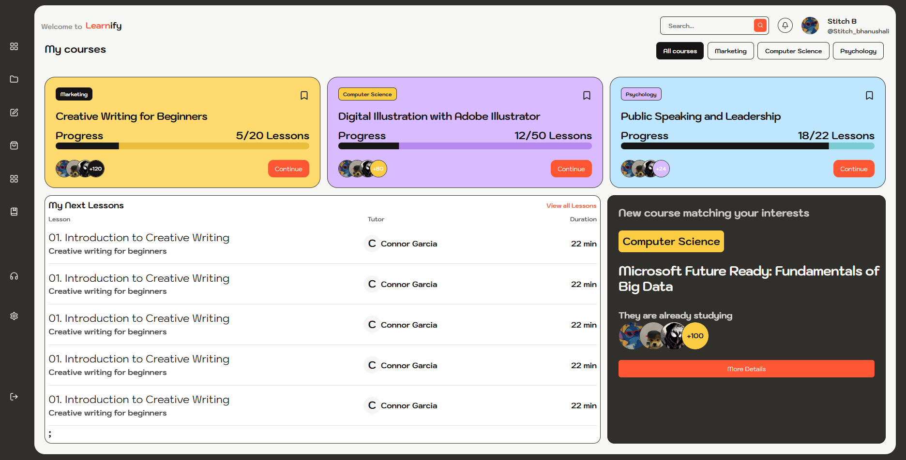

# Learnify 📚

Welcome to **Learnify**, a sleek and responsive educational dashboard inspired by [this Dribbble concept](https://dribbble.com/shots/25317037-Education-Website-Courses). This project replicates the elegant UI/UX design into a working frontend interface that showcases enrolled courses, progress tracking, lesson lists, and personalized course recommendations.

---

## 🌟 Features

- 📋 **Course Overview Cards** with progress tracking and category tags.
- ▶️ **Continue Learning** button for quick resumption.
- 📚 **My Next Lessons** list with tutor info and duration.
- 🔍 **Smart Filtering** by categories (Marketing, Computer Science, Psychology).
- 🧠 **Personalized Course Suggestions** based on user interests.
- 🧑‍🏫 **Avatar Group Displays** showing active learners.
- 🔗 Fully responsive layout with intuitive navigation.

---

## 🛠️ Built With

- **Next.js** – UI framework
- **Tailwind CSS** – Utility-first CSS for rapid styling
- **React Icons** – For modern iconography
- **Custom Components** – Built from scratch to match the Dribbble design

---

## 🚀 Getting Started

To run this project locally:

### 1. Clone the repo

```bash
git clone https://github.com/meeetpandya/learnify-dashboard.git
cd learnify-dashboard
```

````

### 2. Install dependencies

```bash
npm install
```

### 3. Start the development server

```bash
npm start
```

The app will now run at `http://localhost:3000`.

---

## 📸 Screenshot



---

## 🤝 Acknowledgements

- Design inspired by [Dribbble - Education Website Courses](https://dribbble.com/shots/25317037-Education-Website-Courses)
- Icons by [React Icons](https://react-icons.github.io/react-icons/)
- Typography and UI inspired by modern edtech platforms

---

## 📜 License

This project is licensed under the MIT License - see the [LICENSE](LICENSE) file for details.

````
